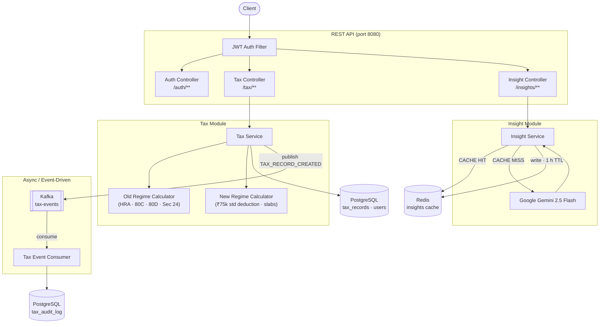

# TaxEase

> AI-powered Indian income tax filing assistant — backend REST API for FY 2025-26.

---

## Overview

TaxEase is a Spring Boot backend that helps salaried employees in India understand and optimise their annual income tax. It computes tax liability under both the **Old Regime** (with deductions for HRA, 80C, 80D, home loan interest) and the **New Regime** (flat slabs, ₹75,000 standard deduction), recommends the regime that saves more money, and generates personalised, actionable saving tips powered by **Google Gemini 2.5 Flash**. Every calculation is persisted, audit-logged asynchronously via **Apache Kafka**, and AI responses are cached in **Redis** to keep repeat queries instant and cost-free.

---

## Features

- **JWT Authentication** — stateless token-based auth with Spring Security; every protected endpoint validates the bearer token before processing
- **Dual-regime tax calculation** — pixel-accurate FY 2025-26 slab logic for both regimes, including 87A rebate, HRA three-way exemption, and all standard deduction caps
- **AI-powered tax saving tips** — personalised advice via Google Gemini 2.5 Flash based on the user's exact income and deduction profile; automatic rule-based fallback when the API is unavailable
- **Event-driven audit logging** — every tax calculation publishes a `TAX_RECORD_CREATED` event to Kafka; a consumer independently persists an immutable audit log row, keeping the write path decoupled from the response path
- **Redis caching for AI responses** — cache-aside pattern with a 1-hour TTL; identical tax profiles return cached Gemini tips instantly without an API call

---

## Tech Stack

| Layer | Technology |
|---|---|
| Language | Java 17 |
| Framework | Spring Boot 3.2 |
| Security | Spring Security + JJWT 0.12 |
| Database | PostgreSQL 15 |
| Messaging | Apache Kafka (KRaft, no Zookeeper) |
| Cache | Redis 7 |
| AI | Google Gemini 2.5 Flash API |
| Testing | JUnit 5 + Mockito + AssertJ |
| Infrastructure | Docker Compose |
| API Docs | Swagger / OpenAPI 3 (Springdoc) |

---

## Architecture

TaxEase is a **modular monolith** — the codebase is divided into vertical slices (`user`, `auth`, `tax`, `document`, `insight`, `kafka`) that each own their model, service, repository, and controller. Slices communicate through service calls or Kafka events, not shared tables. This keeps the domain logic clean and makes each module independently testable.

```
src/main/java/com/taxease/
├── auth/           # Registration and login
├── user/           # User profile management
├── tax/            # Slab calculators, TaxRecord persistence
├── document/       # Document upload and management
├── insight/        # Gemini integration, Redis cache, legacy insights
├── kafka/
│   ├── event/      # TaxEvent, DocumentEvent (message contracts)
│   ├── producer/   # TaxEventProducer, DocumentEventProducer
│   └── consumer/   # TaxEventConsumer → TaxAuditLog
├── config/         # KafkaConfig, RedisConfig, SecurityConfig, SwaggerConfig
└── security/       # JWT filter, UserDetailsService
```

### Request Flow



---

## Getting Started

### Prerequisites

| Tool | Minimum version |
|---|---|
| Java | 17 |
| Maven | 3.9 |
| Docker Desktop | 4.x |
| PostgreSQL | 15 |

### Setup

**1. Clone the repository**

```bash
git clone https://github.com/Mitalii9/taxease.git
cd taxease
```

**2. Start Kafka and Redis**

```bash
docker compose up -d
```

This starts a single-broker Kafka cluster in KRaft mode on `localhost:9092` and Redis on `localhost:6379`. The three Kafka topics (`tax-events`, `document-events`, `insight-events`) are created automatically on first boot.

**3. Create the PostgreSQL database**

```sql
CREATE DATABASE taxease;
```

The default connection expects `localhost:5432`, username `postgres`. Override with environment variables if your setup differs:

```bash
export SPRING_DATASOURCE_URL=jdbc:postgresql://localhost:5432/taxease
export SPRING_DATASOURCE_USERNAME=postgres
export SPRING_DATASOURCE_PASSWORD=yourpassword
```

Hibernate is configured with `ddl-auto: update` — all tables are created automatically on first run.

**4. Set your Gemini API key**

Obtain a free key from [Google AI Studio](https://aistudio.google.com/) and export it:

```bash
export GEMINI_API_KEY=your_api_key_here
```

The AI tips endpoint degrades gracefully to a rule-based fallback if this key is absent or the API is unreachable, so the rest of the application works without it.

**5. Run the application**

```bash
mvn spring-boot:run
```

The API starts on `http://localhost:8080/api`.

Interactive API docs: `http://localhost:8080/api/swagger-ui.html`

---

## API Endpoints

### Authentication

| Method | Endpoint | Description |
|---|---|---|
| `POST` | `/api/auth/register` | Register a new user account |
| `POST` | `/api/auth/login` | Login and receive a JWT bearer token |

### Tax Calculation

| Method | Endpoint | Auth | Description |
|---|---|---|---|
| `POST` | `/api/tax/calculate` | Required | Calculate old vs new regime tax, persist the result, and publish a Kafka event |
| `GET` | `/api/tax/history` | Required | Retrieve all past calculations for the authenticated user |

### AI Insights

| Method | Endpoint | Auth | Description |
|---|---|---|---|
| `POST` | `/api/insights/tax-tips` | Required | Get personalised Gemini-powered tips (Redis cached, 1 h TTL) |
| `GET` | `/api/insights/{userId}/{taxYear}` | Required | Retrieve stored insights for a specific user and tax year |

### Users

| Method | Endpoint | Auth | Description |
|---|---|---|---|
| `GET` | `/api/users/profile` | Required | Get the authenticated user's profile |

> All protected endpoints require the header `Authorization: Bearer <token>`.

### Example: Calculate Tax

Request:

```json
POST /api/tax/calculate
{
  "grossSalary": 1200000,
  "basicSalary": 500000,
  "hraReceived": 200000,
  "rentPaid": 240000,
  "metroCity": true,
  "investment80C": 150000,
  "medical80D": 25000,
  "homeLoanInterest": 200000
}
```

Response:

```json
{
  "grossSalary": 1200000,
  "taxOldRegime": 20280.00,
  "taxNewRegime": 71500.00,
  "recommendedRegime": "OLD",
  "savings": 51220.00,
  "deductions": {
    "standardDeductionOld": 50000,
    "hraExemption": 200000,
    "deduction80C": 150000,
    "deduction80D": 25000,
    "homeLoanInterestSec24": 200000,
    "totalOldRegimeDeductions": 625000,
    "taxableIncomeOldRegime": 575000,
    "standardDeductionNew": 75000,
    "taxableIncomeNewRegime": 1125000
  }
}
```

---

## Testing

The test suite contains **21 unit tests** across three classes, covering all slab boundaries, deduction caps, rebate logic, and service orchestration.

```bash
mvn test
```

| Test Class | Tests | What it covers |
|---|---|---|
| `NewRegimeCalculatorTest` | 5 | 87A rebate boundary, 12L and 20L slab arithmetic, standard deduction, taxable income floor |
| `OldRegimeCalculatorTest` | 10 | All three HRA exemption branches, 80C / 80D / home loan caps, 12L full scenario (→ ₹20,280), 87A rebate |
| `TaxServiceTest` | 6 | Regime selection logic, savings = \|oldTax − newTax\|, repository save, Kafka event payload |

Calculator tests instantiate classes directly with `new` — no Spring context, no I/O. `TaxServiceTest` uses `@ExtendWith(MockitoExtension.class)` with `@Mock` for all four dependencies and `ArgumentCaptor` to assert the exact content of the persisted record and the published Kafka event.

All monetary assertions use AssertJ's `isEqualByComparingTo()`, which delegates to `BigDecimal.compareTo()` and ignores scale differences (`20280` vs `20280.00`).

---

## Key Design Decisions

### BigDecimal for all monetary values

`double` and `float` cannot represent most decimal fractions exactly. A tax of ₹19,500.00 stored as a float can silently become ₹19,499.9997 before cess is applied, producing a wrong final figure. Every monetary field is `BigDecimal` with an explicit scale and `RoundingMode.HALF_UP` applied only at the final output step.

### Cache-aside over `@Cacheable` for AI responses

Spring's `@Cacheable` is transparent but opaque — there is no hook for custom fallback behaviour when the cache store is unavailable. The AI tips endpoint uses manual cache-aside so that a Redis failure logs a warning and falls through to Gemini rather than propagating a connection error to the HTTP response. The read, the Gemini call, and the write are each wrapped in independent `try-catch` blocks, so no single failure can block the user from receiving tips.

### Graceful degradation at every external boundary

Three external services can fail independently — Kafka, Redis, and Gemini. Each is isolated:

- **Kafka down** — the tax calculation is saved to Postgres and the HTTP response is returned normally; a `WARN` log records the missed publish
- **Redis down** — Gemini is called directly on both read and write failure; the response is never blocked by the cache
- **Gemini down** — a deterministic rule-based engine generates tips from the user's actual unused deduction headroom (80C, 80D, HRA, NPS)

No single external failure can cascade into a failed API response.

### Event-driven audit log

Persisting a `TaxAuditLog` row inside the same HTTP transaction as the tax calculation would couple the audit concern to the response latency and failure domain of the main write. Publishing to Kafka and consuming asynchronously means the audit write is completely independent: it never slows the API response, and the event can be replayed from the topic if the consumer was temporarily down.
